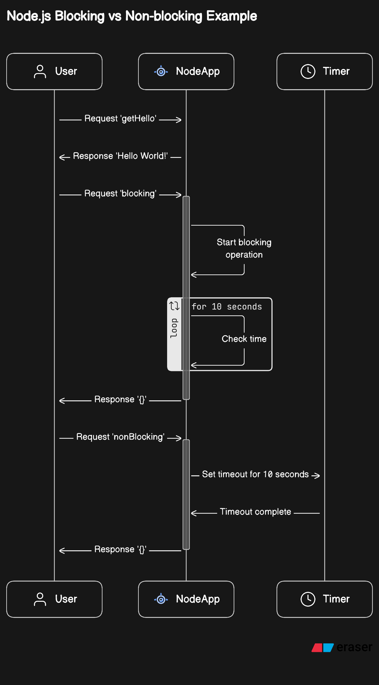

# Understanding Synchronous vs. Asynchronous Operations in Node.js using NestJS

### Installation

```bash
$ pnpm install
```

## Running the app

```bash
$ pnpm run start:dev
```

### Introduction:

Node.js is known for its non-blocking, event-driven architecture, allowing developers to build scalable and efficient applications. However, understanding synchronous and asynchronous operations within Node.js is crucial for optimizing performance.



**Code Explanation:**

The provided code snippet is a TypeScript class within a NestJS application. It illustrates the concepts of synchronous blocking and asynchronous non-blocking operations.

Service Structure:

```typescript
import { Injectable } from '@nestjs/common';

@Injectable()
export class AppService {
  getHello(): string {
    return 'Hello World!';
  }

  blocking() {
    // Synchronous, blocking operation
    const now = new Date().getTime();
    while (new Date().getTime() < now + 10000) {}
    return {};
  }

  async nonBlocking() {
    // Asynchronous, non-blocking operation
    return new Promise(async (resolve) => {
      setTimeout(() => {
        resolve({});
      }, 10000);
    });
  }
}
```

Controller Structure:

```typescript
import { Controller, Get } from '@nestjs/common';
import { AppService } from './app.service';

@Controller()
export class AppController {
  constructor(private readonly appService: AppService) {}

  @Get()
  getHello(): string {
    return this.appService.getHello();
  }

  @Get('blocking')
  blocking() {
    return this.appService.blocking();
  }

  @Get('nonBlocking')
  async nonBlocking() {
    return this.appService.nonBlocking();
  }
}
```

**Synchronous Blocking Operation (blocking()):**
This method performs a synchronous, blocking operation by using a busy-wait loop. It captures the current time and enters a loop that delays code execution for approximately 10 seconds. During this period, the CPU remains engaged, unable to handle other tasks or **API** requests.

**Asynchronous Non-blocking Operation (nonBlocking()):**
This method demonstrates an asynchronous, non-blocking operation using setTimeout. It returns a promise that resolves after approximately 10 seconds. Unlike the blocking() method, this operation immediately returns a promise, allowing the event loop to handle other tasks.

## Certainly! In simpler terms:

#### Blocking Endpoint (/blocking):

- Imagine you're waiting in line at a food stall where the person at the front of the line is taking a long time to order.
- When you ask for something at /blocking, it's like waiting in this slow-moving line. You have to wait until the person at the front finishes their order before you can place yours.
- Other people who come after you also have to wait in this same line until your order (the blocking operation) finishes.

#### Non-blocking Endpoint (/nonBlocking):

- Now, imagine you're at a different food stall where you place your order and the stall owner says, "Your food will take 10 minutes, but you don't have to wait here. You can do other things and come back later."
- When you request something at /nonBlocking, it's like that. You're told that the food (the result of your request) will take time, but you're free to do other things while waiting.
- Other people who come after you can place their orders without waiting for your order to be ready.
- So, calling /blocking makes everyone wait until the slow operation completes, while calling /nonBlocking allows you to do other things while waiting for the result, and others don't have to wait for your specific request to finish.

# Conclusion:

In Node.js applications, employing asynchronous, non-blocking operations is essential for maintaining responsiveness and scalability. Avoiding synchronous, blocking operations is crucial to prevent hindering the event loop and overall application performance.

## Horizontal scaling

pnpm autocannon localhost:3000/promises -c 10000 -t 30 -d 60

docker build -t nodejs-concepts -f Dockerfile .
docker tag nodejs-concepts iamjaidev/nodejs-concepts:latest
docker push iamjaidev/nodejs-concepts:latest

install helm

```bash
mkdir k8s
cd k8s
helm create nodejs-concepts
cd nodejs-concepts
kubectl create deployment nodejs-concepts --image=iamjaidev/nodejs-concepts:latest --port 3000 --dry-run=client -o yaml > deployment.yaml
kubectl create svc nodeport nodejs-concepts --tcp=3000:3000 --dry-run=client -o yaml > service.yaml

cd k8s #  \k8s\nodejs-concepts folder
helm install nodejs-concepts .

kubectl get po
kubectl logs {pod_name}
kubectl get svc
kubectl scale deployment nodejs-concepts --replicas 5
```
